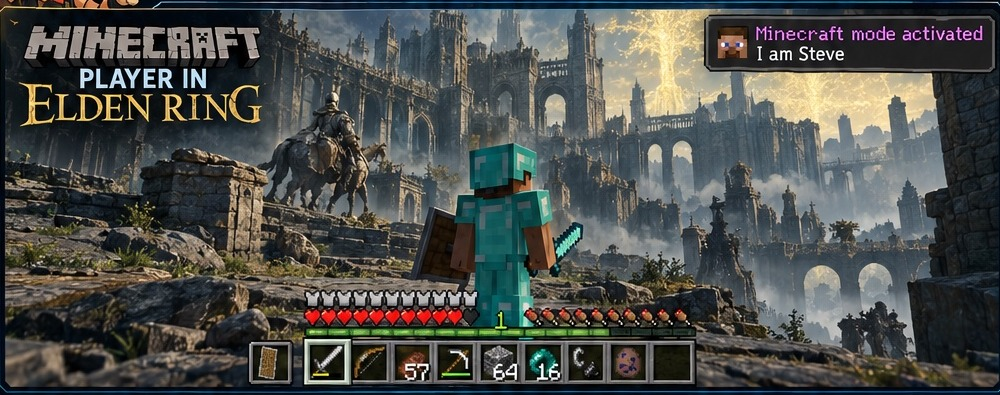

# AI Game Modding Guidebook




Use this repo as context for an AI coding agent working on **game rewrites, recompilation/decompilation, or passthrough mods**.

## Quick start

1. Read the guide first:
   - `markdown/AI_Game_Modding_Rewrites_Passthrough_Guidebook.md`
   - or `pdf/AI_Game_Modding_Rewrites_Passthrough_Guidebook.pdf`
2. Use an **agent that can access your local files and run tools** (for example Claude Code, Codex, or another local coding agent).
3. Give the agent this repo, or send it the repository URL.
4. Fill in the project template below and give it to the agent.
5. Tell the agent to use the guide as its reference architecture, inspect the actual games/tools available, and proceed one verified step at a time.

## Project template

Copy, fill out, and send this with the repo/guide:

```text
GOAL
Project type: [Passthrough mod / Rewrite / Decomp + rewrite / Unsure]
What I want to build:

SYSTEM
OS: [Windows / Linux / macOS]
CPU:
RAM:
GPU:
VRAM:
Available disk space:

AI SETUP
Agent: [Claude Code / Codex / OpenCode / other]
Model/provider:
Local model, if any:

GAME A
Game:
Platform/version: [PC / PS2 / PS3 / PS4 / Xbox / etc.]
Engine, if known:
Game binary/install location:
Mod loader / script extender / SDK, if known:
Emulator, if applicable:
Source/decomp/recomp project, if any:

GAME B
Game:
Platform/version:
Engine, if known:
Game binary/install location:
Mod loader / script extender / SDK, if known:
Emulator, if applicable:
Source/decomp/recomp project, if any:

TOOLS ALREADY INSTALLED
[Git, Ghidra, Rust, Python, Java/JDK, Node.js, emulator, SDKs, etc.]

CONSTRAINTS
Offline only?:
Must preserve original saves?:
Things that must not be modified:
Known DRM / anti-cheat / online-only limitations:

FIRST MILESTONE
Example: "Send player position from Game A to Game B" or "Identify and decompile the main game binary."
```

## Starter prompt

```text
Read the AI Game Modding Guidebook in this repository before doing anything.

Use it as your reference for terminology, architecture, tooling, decompilation/rewrite workflows, passthrough design, testing, and platform-specific constraints.

Then review the project information I provided. Act as the technical orchestrator for the project:

- determine which workflow fits the goal: passthrough, rewrite/recomp, or a hybrid;
- inspect the actual files, binaries, engines, loaders, SDKs, emulators, and existing open-source projects before choosing tools;
- prefer existing mod loaders, APIs, recomp projects, and documented integrations over unnecessary reverse engineering;
- verify commands and tool usage from primary documentation before running them;
- work incrementally and establish the smallest functioning milestone first;
- keep original game files and saves backed up;
- do not guess when evidence is missing;
- report blockers clearly;
- ask before destructive or irreversible changes.

Start by summarizing the proposed architecture, the tools you verified are applicable, and the first concrete milestone. Then proceed with implementation.
```

## Important

The guide is a reference, not proof that every pair of games can be combined. The agent still needs to inspect the specific games, platforms, mod loaders, emulator capabilities, binaries, and existing community tooling before committing to an architecture.

Keep proprietary game files out of the repository. Store only your own code, documentation, patches, and permitted project assets.
