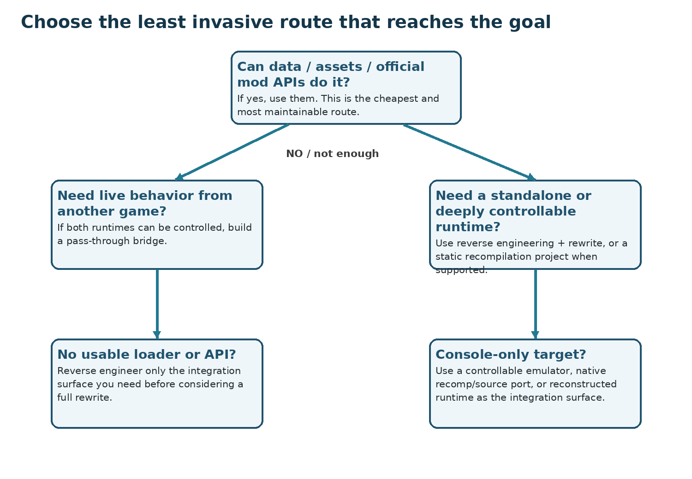
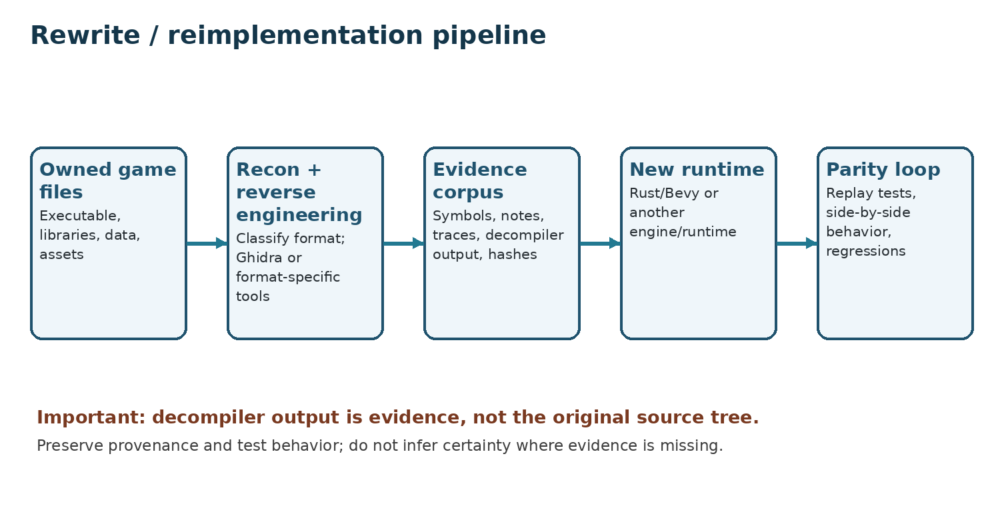
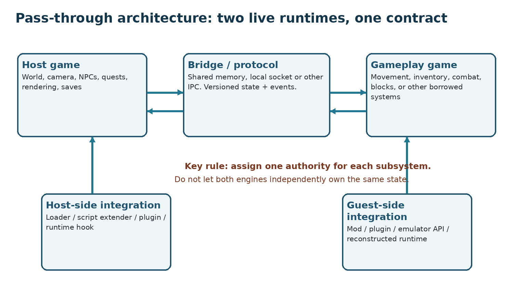
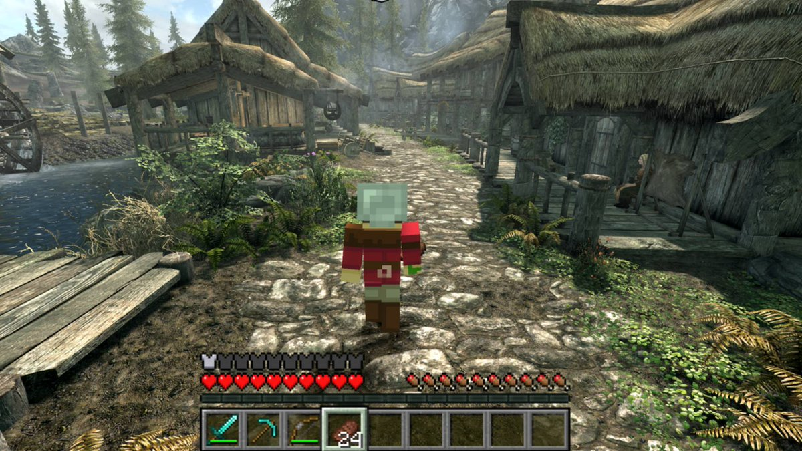
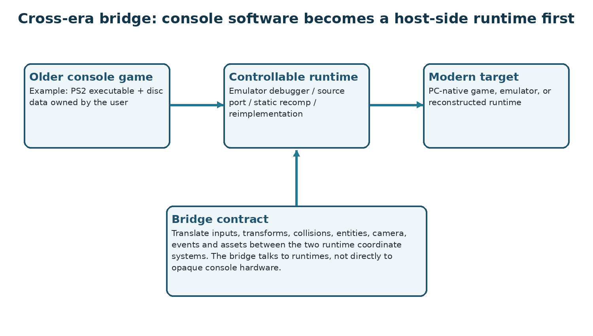
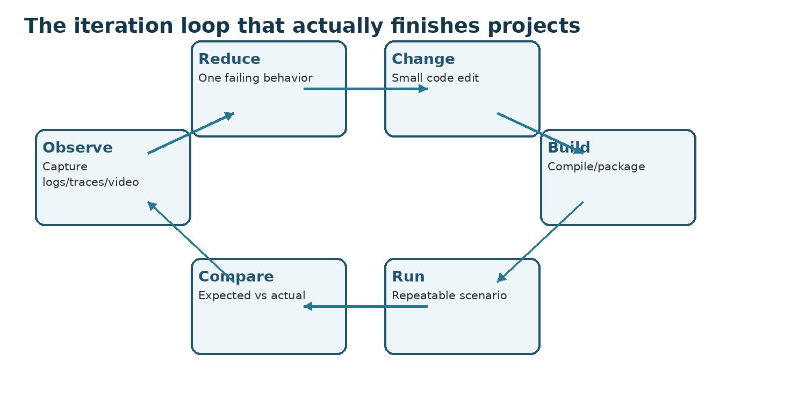

**AI-ASSISTED GAME  
REVERSE ENGINEERING, REWRITES  
& PASS-THROUGH MODDING**

A source-checked field guide to AI-assisted game modding, live game bridges, decompilation, static recompilation and behavioral reimplementation

**Verified edition: 3 October 2026**

*Scope: games you own, offline/single-player research and modding. This book does not provide DRM, anti-cheat or ownership-bypass instructions.*

# 0. How to use this book

This book deliberately separates three activities that are often mixed together online: ordinary modding, pass-through bridging, and reverse-engineering/rewrite work. The safest and most maintainable project is normally the least invasive route that achieves the intended behavior. The guide therefore begins with route selection, then gives complete workflows for reverse engineering/reimplementation and for pass-through bridges.

## 0.1 Agent-first workflow

For this kind of work, an AI coding agent means a tool that can inspect local files, edit a working tree, run compilers/decompilers, execute tests and return the resulting logs. A plain chat session without filesystem and terminal/build access can explain the process, but it cannot perform the local inspection-build-playtest loop. The community guide collection in \[S05\] treats this distinction as the starting point; this book keeps the recommendation tool-agnostic.

| **Community workflow rule**                      | **Why it matters**                                                                                   | **How this guide applies it**                                                                                                                                         |
|--------------------------------------------------|------------------------------------------------------------------------------------------------------|-----------------------------------------------------------------------------------------------------------------------------------------------------------------------|
| Use an agent with local tool access              | The job requires reading installations, writing source and invoking build/reverse-engineering tools. | Use a coding agent or equivalent environment with filesystem, terminal and review/approval controls.                                                                  |
| Check the mod loader or script extender first    | A mature extension point can turn a reverse-engineering problem into a normal plugin project.        | Route selection always checks official/community APIs and loaders before binary hooks or rewrites.                                                                    |
| Install and identify the exact game builds first | Version, architecture and file layout determine compatible loaders, symbols and hooks.               | Record versions and hashes before analysis; point the agent at the local installation rather than uploading retail files.                                             |
| Start from a working reference architecture      | A concrete repository gives the agent real build layout, protocol and failure-handling examples.     | SkyCraft is the pass-through reference; the community guide also points to hl2-rs for rewrite-style work. Read the current README/design docs before adapting either. |
| Expect repeated playtest/fix rounds              | The first prompt rarely proves runtime behavior.                                                     | Work in small vertical slices: inspect -\> build -\> run/playtest -\> report exact observation/log -\> fix -\> commit.                                                |
| Keep game files out of the source repository     | Retail files are version-specific, large and often not redistributable.                              | Commit only original code, schemas, tests and lawful redistributable assets; keep owned game files and generated extracts ignored/private.                            |
| Avoid protected/online-only execution paths      | Anti-cheat, DRM and server authority can make local instrumentation inappropriate or unusable.       | Use offline/single-player builds, official mod environments or a different target; this book does not provide protection-bypass procedures.                           |

Reference projects are architecture examples, not drop-in adapters. Require the agent to identify which assumptions are specific to the reference game, loader, renderer, operating system and protocol before reusing code or commands. Community workflow advice is useful provenance, but version-specific tool claims should still be checked against upstream documentation. \[S05\]\[S63\]\[S64\]\[S65\]\[S66\]

| **Evidence standard** Statements that depend on a particular project or tool are tied to source IDs in the Source Directory. Primary upstream documentation is preferred. Community material is labeled as such. Where a universal numeric answer does not exist - for example, total token consumption or a GPU requirement for every local model - this guide says so rather than inventing a number. |
|---------------------------------------------------------------------------------------------------------------------------------------------------------------------------------------------------------------------------------------------------------------------------------------------------------------------------------------------------------------------------------------------------------|

**Contents**

- 1 Overview: the four routes

- 2 Terminology

- 3 Feasibility and route selection

- 4 Requirements, cost and model choices

- 5 Cross-platform workstation setup

- 6 Reconnaissance and binary classification

- 7 Decompilation and reverse-engineering workflow

- 8 Evidence databases and indexing

- 9 Rewrite / behavioral reimplementation

- 10 Static recompilation

- 11 Pass-through modding: complete workflow

- 12 Cross-era and console combinations

- 13 Windows, Linux and macOS nuances

- 14 Testing, parity and performance

- 15 Packaging, distribution and maintenance

- 16 Troubleshooting and failure modes

- 17 Prompt library

- 18 Command reference

- 19 Resource directory and source ledger

# 1. Overview: the four routes

A modern AI coding agent can read a working tree, run tools, compile code and iterate on failures. That changes the speed of experimentation, but it does not change the underlying engineering choices. Before touching a binary, decide which of the following four routes actually matches the goal.

A useful reference-project method is to give the agent a known working project and ask it to first explain that project’s architecture, then map each component to the target games. The community guide collection uses SkyCraft for pass-through work and hl2-rs as a rewrite reference. This book adds IW4L and skate3clone as further rewrite/reconstruction examples. \[S05\]\[S66\]\[S01\]\[S06\]\[S07\]

| **Route**           | **What changes**                                            | **When it fits**                                                                           | **Representative evidence**                                                                 |
|---------------------|-------------------------------------------------------------|--------------------------------------------------------------------------------------------|---------------------------------------------------------------------------------------------|
| Data / asset mod    | Game data, scripts, configuration or supported mod packages | The desired feature is already expressible through the game or community modding interface | Universal Modder route table; tModLoader/SMAPI/Fabric examples \[S04\]\[S22\]\[S27\]\[S28\] |
| Loader / plugin mod | A plugin or script executes inside the original game        | A loader exposes the hooks you need                                                        | SKSE, BepInEx, UE4SS, REFramework \[S23-S26\]                                               |
| Pass-through        | Two live runtimes are connected by a protocol               | You want one game to supply behavior to another without replacing both engines             | SkyCraft; LibertyCraft \[S01\]\[S03\]                                                       |
| Rewrite / recomp    | A new runtime executes recovered or translated behavior     | You need a standalone, deeply controllable or portable runtime                             | IW4L, skate3clone, N64Recomp \[S06\]\[S07\]\[S30\]                                          |

*Figure 1. Route-selection decision tree. The order is intentional: use the least invasive route that reaches the goal.*

SkyCraft is the clearest current pass-through reference. Its project description states that neither Skyrim nor Minecraft is rewritten: Minecraft continues to run its own game logic, Skyrim continues to run its world, NPCs, quests and saves, and an SKSE plugin plus Fabric mod communicate through shared memory. LibertyCraft explicitly ports the same idea to GTA IV. \[S01\]\[S03\]

IW4L demonstrates the rewrite side: it is a new Rust runtime built with Bevy/wgpu that reads data from an MW2 installation the user already owns. The Skate 3 preservation project similarly describes itself as a source-only Rust/Bevy reconstruction with evidence-backed behavioral parity and private retail-derived outputs. \[S06\]\[S07\]

| **Do not conflate routes** A rewrite can later become one side of a pass-through bridge, but a full rewrite is not a prerequisite for the ordinary SkyCraft-style two-live-game path. |
|---------------------------------------------------------------------------------------------------------------------------------------------------------------------------------------|

Sources: \[S01\], \[S03\], \[S04\], \[S05\], \[S06\], \[S07\], \[S30\], \[S66\]

# 2. Terminology

| **Term**                    | **Meaning**                                                                                                                                                                               |
|-----------------------------|-------------------------------------------------------------------------------------------------------------------------------------------------------------------------------------------|
| AI coding agent             | A terminal/desktop coding system that can inspect local files, edit source and invoke build/test tools. Examples in this guide include Pi, Claude Code and Codex CLI.                     |
| Host game                   | The game whose world/window/rendering is the primary visible experience in a pass-through project.                                                                                        |
| Gameplay provider / guest   | The second runtime whose mechanics are being borrowed - movement, inventory, block logic, combat, vehicles, etc.                                                                          |
| Integration layer           | Code loaded into a game through a loader, script extender, plugin system, official SDK or other supported extension point.                                                                |
| Bridge / IPC                | The local communications layer between processes or runtimes. SkyCraft uses a shared-memory protocol; other projects may use local sockets or platform IPC.                               |
| Authority                   | The one runtime designated as the source of truth for a subsystem. Example: Minecraft owns movement while Skyrim owns NPC quest state.                                                    |
| Proxy entity                | A representation of an entity from one runtime inside the other, used for collision, combat, targeting or synchronization.                                                                |
| Decompilation               | Conversion of machine/bytecode into a higher-level approximation. It does not restore the original source tree, comments or names.                                                        |
| Disassembly                 | Representation of machine code as instructions.                                                                                                                                           |
| Reverse engineering         | The broader evidence-gathering process: static analysis, dynamic traces, asset formats, symbols, debugging and behavioral tests.                                                          |
| Behavioral reimplementation | New code intended to reproduce observed behavior without pretending it is structurally identical to the original source.                                                                  |
| Static recompilation        | Translation of an existing machine-code binary into another compilable representation or native host execution path, usually with platform-specific runtime support.                      |
| Parity                      | A defined level of agreement between the new implementation and the reference game: file coverage, state transitions, physics, rendering, timings, etc.                                   |
| Vertical slice              | The smallest end-to-end feature that proves the architecture - for pass-through, often one value crossing both directions; for a rewrite, one observable subsystem reproduced and tested. |
| Oracle                      | A source of truth used by tests: captured original-game traces, screenshots, hashes, replay state or a debugger-observed result.                                                          |

The phrase “decompile the game” is often too vague to be actionable. A modern title may contain native C/C++, .NET/Mono, Unity IL2CPP, Java, Lua, Python bytecode, shader bytecode and proprietary data formats in the same installation. The first engineering step is therefore classification, not decompilation.

# 3. Feasibility and route selection

Age is not the deciding factor. The decisive question is whether you can obtain a controllable runtime surface for each side. An older game can be easy if it has an open source port or rich emulator debugger; a recent PC title can be hard if it exposes no loader and is inseparable from online/anti-cheat infrastructure.

| **Condition**                                             | **Implication**                                     | **Recommended response**                                                                             |
|-----------------------------------------------------------|-----------------------------------------------------|------------------------------------------------------------------------------------------------------|
| Official or mature mod API exists                         | Best case                                           | Use the API first; do not reverse engineer what is already exposed.                                  |
| Community loader/script extender exists                   | Good pass-through candidate                         | Create a minimal plugin on each side, prove a handshake, then expand.                                |
| Managed runtime (.NET/Mono/Java)                          | Often easier to inspect than stripped native code   | Use a format-specific decompiler and runtime patching where appropriate.                             |
| Native PC binary with no loader                           | Possible but integration is title-specific          | Reverse engineer only the needed hooks; full rewrite is a separate decision.                         |
| Console title with a mature emulator debugger             | Potentially bridgeable through the emulator/runtime | Treat the emulator as the integration surface.                                                       |
| Static recomp/source port exists                          | Excellent integration surface                       | Expose a narrow API from the native runtime rather than redoing the entire game.                     |
| Online-only or anti-cheat protected execution is required | Unsuitable for this guide’s workflow                | Do not bypass protections. Choose an offline build, official mod environment or a different project. |
| DRM/ownership checks block access                         | Stop condition here                                 | This book does not provide bypass steps. Use a legally accessible/mod-friendly copy.                 |

| **RollerCoaster Tycoon 2 is not a good “impossible” example** OpenRCT2 exposes a JavaScript plugin system. That illustrates the general rule: old does not mean unbridgeable; the available runtime hooks matter more than release year. \[S29\] |
|--------------------------------------------------------------------------------------------------------------------------------------------------------------------------------------------------------------------------------------------------|

For any game pair, create a one-page feasibility sheet before committing to a rewrite. Record: exact game/version, executable format and architecture, mod loaders, scripting runtime, renderer/API, save location, offline capability, emulator compatibility if relevant, and the smallest state you can already read or write.

Sources: \[S04\], \[S05\], \[S23\], \[S24\], \[S25\], \[S26\], \[S29\], \[S32\], \[S33\], \[S34\], \[S65\]

# 4. Requirements, cost and model choices

There is no honest universal “PC spec for AI game modding.” The workload is the union of three independent requirements: the games themselves, the analysis/build tools, and the model runtime if you choose a local model. The reliable method is to meet each upstream requirement independently, then test the combined workload.

**Verified baseline requirements**

| **Component**                      | **Verified requirement / fact**                                                                                                                                                     | **Source**            |
|------------------------------------|-------------------------------------------------------------------------------------------------------------------------------------------------------------------------------------|-----------------------|
| Ghidra 12.2 documentation          | 4 GB RAM minimum; 1 GB storage for installed Ghidra binaries; 64-bit JDK 25; Python 3.9-3.14 for PyGhidra. Windows 10+, Linux, macOS 10.13+.                                        | \[S10\]               |
| Pi via npm                         | Node.js 22.19 or newer. Pi can instead be installed through its platform installer/Nix.                                                                                             | \[S35\]\[S46\]        |
| Bevy                               | Latest stable Rust; Windows needs MSVC/Windows SDK/CMake tools, macOS Xcode command-line tools, Linux platform dependencies.                                                        | \[S21\]               |
| SkyCraft specific runtime overhead | Current README mirror states roughly 3 GB extra RAM and about 1.5 GB disk for its bundled Minecraft side; this is project-specific, not a universal pass-through requirement.       | \[S01\]               |
| Local models                       | Pi supports local GGUF via llama.cpp and compatible endpoints. Memory requirements are model/quantization/context specific; there is no model-independent VRAM figure in Pi’s docs. | \[S36\]\[S37\]\[S38\] |

**Hosted-agent cost facts (price snapshot)**

As of 3 October 2026, Anthropic documents Claude Pro at \$20/month, Max 5x at \$100/month and Max 20x at \$200/month for individual web subscriptions; Claude Code is included in Max and is also available on other supported plans. Usage limits apply and prices can change. Codex is included across current ChatGPT plan tiers according to its current pricing page; plan limits and pricing should be checked immediately before purchase. \[S40\]\[S41\]\[S43\]

| **What this book will not invent** There is no verified universal token count or project price for “rewrite a game” or “make a pass-through.” Public projects vary enormously and most do not publish complete billing logs. Budget by the subscription/API’s current meter and your measured iteration rate, not by a fabricated project-wide token estimate. |
|----------------------------------------------------------------------------------------------------------------------------------------------------------------------------------------------------------------------------------------------------------------------------------------------------------------------------------------------------------------|

**Agent setup choices**

| **Setup**                           | **Advantages**                                                                                          | **Constraints / verification**                                                                                            |
|-------------------------------------|---------------------------------------------------------------------------------------------------------|---------------------------------------------------------------------------------------------------------------------------|
| Claude Code / hosted model          | Strong terminal-agent workflow; subscription plans documented by Anthropic.                             | Cloud usage limits and pricing apply; verify current plan page \[S40\]\[S41\].                                            |
| OpenAI Codex CLI                    | Runs locally as an agent and can sign in with a supported ChatGPT plan or use API configuration.        | Install/auth behavior can change; use current README \[S42\]\[S43\].                                                      |
| Pi + hosted provider                | Provider-agnostic terminal agent; subscription/API login through /login.                                | Pi is the orchestration layer, not the model \[S35\]\[S36\].                                                              |
| Pi + llama.cpp local GGUF           | No per-token cloud charge; files/context remain local to your machine unless other tools transmit them. | Performance and memory depend on chosen model/quantization/context; verify model card and llama.cpp build \[S37\]\[S38\]. |
| LM Studio / compatible local server | Graphical local-model manager with local server APIs; can be used by compatible agents.                 | Model quality/tool-use capability is model-specific \[S39\].                                                              |

**A verified Pi local-model path**

\# Install Pi on macOS/Linux  
curl -fsSL https://pi.dev/install.sh \| sh  
  
\# Or install with npm (Node.js 22.19+ required)  
npm install -g --ignore-scripts @earendil-works/pi-coding-agent  
  
pi --version  
cd /path/to/your/project  
pi  
  
\# Inside Pi  
/login  
/model

For a local llama.cpp router, Pi’s current documentation uses a local-only server similar to the following. Choose the actual model and context based on its model card and your measured memory capacity, not a generic recommendation. \[S37\]

llama-server \\  
--models-dir ~/models \\  
--no-models-autoload \\  
--jinja \\  
--host 127.0.0.1 \\  
--port 8080 \\  
-ngl 999 \\  
-c 32768  
  
\# In Pi  
/login llama.cpp  
/llama  
/model

Sources: \[S10\], \[S21\], \[S35\], \[S36\], \[S37\], \[S38\], \[S40\], \[S41\], \[S42\], \[S43\], \[S46\]

# 5. Cross-platform workstation setup

Use a separate research workspace. Keep retail game files outside the Git repository and treat the originals as read-only. Work from copies, generated extraction directories and ignored private folders. This pattern is visible in the source-only rewrite projects: IW4L points at the user’s owned install; skate3clone keeps retail-derived outputs private; SkyCraft requires ownership of both games. \[S01\]\[S06\]\[S07\]

**Recommended workspace layout**

research-root/  
README.md  
AGENTS.md  
notes/  
captures/  
traces/  
hashes/  
tooling/  
decomp/ \# generated analysis output, usually ignored/private  
rewrite/ \# your source code  
bridge/ \# protocol + host/guest integration code  
tests/  
private-game-data/ \# never commit; owned retail-derived files only

**Core installations**

| **Tool** | **Windows**                                                                                                 | **Linux**                                                 | **macOS**                                            |
|----------|-------------------------------------------------------------------------------------------------------------|-----------------------------------------------------------|------------------------------------------------------|
| Git      | Use current installer/winget from Git project.                                                              | Use distro package manager.                               | Xcode CLT or Homebrew; Git lists both.               |
| Python   | Python Install Manager is the current Windows path; \`winget install 9NQ7512CXL7T\` is documented for 26.3. | Use distro packages unless project says otherwise.        | System/package manager or python.org as appropriate. |
| Rust     | Run rustup-init.exe; Visual C++ build tools may be required.                                                | rustup shell installer or distro rustup where documented. | rustup; Xcode CLT for native builds.                 |
| Ghidra   | Extract release; JDK 25 64-bit; launch \`ghidraRun.bat\`.                                                   | Extract; JDK 25; launch \`./ghidraRun\`.                  | Extract; JDK 25; launch \`./ghidraRun\`.             |
| Bevy     | Visual Studio C++ Build Tools: Desktop development with C++.                                                | Install Bevy’s listed distro dependencies.                | \`xcode-select --install\`.                          |
| Pi       | Native Windows guide/Git Bash or WSL; npm route available.                                                  | Installer or npm/Nix.                                     | Installer or npm/Nix.                                |

Sources: \[S10\], \[S20\], \[S21\], \[S35\], \[S44\], \[S45\]

**Rust/Bevy quick verification**

\# Linux/macOS/WSL Rust installer  
curl --proto '=https' --tlsv1.2 -sSf https://sh.rustup.rs \| sh  
  
rustc --version  
cargo --version  
  
cargo new my_bevy_game  
cd my_bevy_game  
cargo add bevy  
cargo run

**Ghidra launch verification**

\# Windows  
ghidraRun.bat  
  
\# Linux/macOS  
./ghidraRun  
  
\# PyGhidra if needed  
./support/pyghidraRun

Optional Pi extension stack

These are optional community Pi packages, not prerequisites for Ghidra, rewrites or pass-through modding. Read each current package page, understand its permissions/behavior and pin versions where practical before adding it to an agent environment. The authentication install command below is included as a concrete example; use the current package page for every other package.

pi install npm:@gotgenes/pi-anthropic-auth

- codebasememory: see \[S52\]

- RTK optimizer: see \[S53\]

- billion-context: see \[S54\]

- MCP adapter: see \[S55\]

- ask-user-question: see \[S56\]

- background tasks: see \[S57\]

- ponytail: see \[S58\]

- btw: see \[S59\]

- prompt enhancer: see \[S60\]

- invisible continue: see \[S61\]

- web UI: see \[S62\]

# 6. Reconnaissance and binary classification

Do not begin with “open every EXE in Ghidra.” Start by inventorying the installation and classifying executable/runtime formats. A mixed game can require more than one tool.

**Recon checklist**

- Hash the executable and key libraries so every observation is tied to an exact build.

- Record file path, size, architecture, bitness, executable format and imported runtimes/libraries.

- Look for explicit managed-runtime evidence: .NET assemblies and metadata, Java/JAR/DEX, Unity Mono Managed folders, Unity IL2CPP metadata/native libraries, Lua/Python bytecode containers.

- Record engine/version evidence from file layout, exported symbols, modules, build strings and community documentation.

- Check for a supported mod loader before reverse engineering deeper. Universal Modder explicitly ranks data/API/loader routes ahead of binary hooks. \[S04\]

- Identify whether the intended test mode is fully offline. Stop if the route would require bypassing anti-cheat, DRM or ownership checks.

- Create a short “known / inferred / unresolved” table. Do not let an agent silently convert guesses into facts.

| **Detected format**    | **Preferred first inspection tool**                 | **Important limitation**                                                                             |
|------------------------|-----------------------------------------------------|------------------------------------------------------------------------------------------------------|
| Native PE/ELF/Mach-O   | Ghidra \[S09-S11\]                                  | Decompiler output is reconstructed pseudocode; symbols/types may be missing.                         |
| .NET / Mono assemblies | ILSpy / ILSpyCmd \[S12\]                            | Runtime patching and Unity specifics may matter more than static decompilation.                      |
| Android DEX/APK/AAB    | JADX \[S13\]                                        | JADX explicitly warns that decompilation is not always complete.                                     |
| JVM bytecode           | CFR or another current JVM decompiler \[S14\]       | Obfuscation and compiler transforms can reduce readability.                                          |
| Lua bytecode           | LuaDec for supported versions \[S15\]               | Lua bytecode versions differ; confirm exact version.                                                 |
| Python .pyc            | pycdc or version-appropriate tooling \[S16\]        | Bytecode changes by Python version; support is not universal.                                        |
| Unity IL2CPP           | Cpp2IL / Il2CppDumper + native analysis \[S17-S19\] | IL2CPP is native code produced from managed assemblies; metadata/version handling is title-specific. |

| **Language detection is evidence-based, not magic** PE/ELF headers identify the executable container and architecture, not necessarily the original source language. Imported runtimes, RTTI, symbols, metadata and compiler artifacts provide stronger clues, but optimized native code can remain ambiguous. |
|----------------------------------------------------------------------------------------------------------------------------------------------------------------------------------------------------------------------------------------------------------------------------------------------------------------|

# 7. Decompilation and reverse-engineering workflow

The objective of this phase is to create trustworthy evidence that a later implementation can query and test. “Export all source” is an oversimplification: native decompilers reconstruct functions, control flow and data use, but do not restore the developer’s original project structure. Bulk exports normally require scripts or a tool-specific pipeline.

**Step 1 - Establish provenance**

1.  Use a game copy you are entitled to analyze and keep the pristine install separate.

2.  Record exact version/build IDs and hashes.

3.  Create an analysis log with date, tool versions and each imported file.

4.  Back up saves before running experimental integrations.

**Step 2 - Classify before choosing a decompiler**

Run the reconnaissance checklist in Chapter 6. If the main program is native, Ghidra is a sensible default. If it is managed/scripted, use a purpose-built tool first and use Ghidra for native components that remain.

**Step 3 - Create a Ghidra project for native code**

GUI path: create a non-shared project, import the binary, accept/adjust the detected architecture, then run auto-analysis. Save the project under your research workspace. Do not run the project directly from a synced/cloud folder until you have confirmed the tool handles it reliably.

Headless Ghidra is useful for reproducible bulk analysis. The upstream usage form is:

\# Windows: support\analyzeHeadless.bat  
\# Linux/macOS: support/analyzeHeadless  
  
analyzeHeadless \<project_location\> \<project_name\> -import \<binary-or-directory\>

The Headless Analyzer can create/populate projects, analyze imported or existing binaries and execute non-GUI scripts. Use a post-script if you need deterministic exports; do not assume Ghidra has a universal one-command “export original source” function. \[S11\]

**Step 4 - Recover meaning incrementally**

5.  Find entry points and startup code, then identify initialization subsystems.

6.  Rename functions and globals only when evidence supports the name; keep original addresses/IDs in notes.

7.  Recover structures from repeated offset access, RTTI/type info, serialization layouts and cross-references.

8.  Trace one subsystem at a time: input -\> player update -\> physics/collision -\> animation -\> renderer, or another observable chain.

9.  Use dynamic observations where static analysis is ambiguous. Capture arguments, return values, state transitions and timing in repeatable scenarios.

10. Store “proven”, “bounded inference” and “unresolved” separately. The Skate 3 project explicitly uses this evidence discipline. \[S07\]

**Step 5 - Managed/scripted alternatives**

\# ILSpyCmd (.NET)  
dotnet tool install --global ilspycmd  
ilspycmd -p -o decompiled path/to/GameAssembly.dll  
  
\# CFR (JVM)  
java -jar cfr.jar path/to/game.jar --outputdir decompiled

For JADX, use the project’s current CLI/GUI instructions for the specific APK/DEX/AAB. For Lua/Python/IL2CPP, first identify exact bytecode/runtime versions, then follow the chosen tool’s current release documentation. Do not mix output from tools that assume different runtime versions without recording provenance. \[S12-S19\]

**Step 6 - Coverage and integrity**

11. Maintain a manifest of every analyzed artifact and whether it was imported successfully.

12. Hash raw and normalized exports.

13. Record analysis failures and unsupported sections explicitly instead of silently excluding them.

14. Keep addresses or stable symbol IDs so later rewrite code can point back to evidence.

15. Create small trace/replay fixtures before translating behavior.

| **Packer/protector rule** You may identify that a binary is packed/protected and document that static analysis is blocked. This guide does not provide instructions for defeating DRM, ownership checks or anti-cheat. If a legally accessible unpacked/mod-friendly build is not available, choose a different route. |
|------------------------------------------------------------------------------------------------------------------------------------------------------------------------------------------------------------------------------------------------------------------------------------------------------------------------|

Sources: \[S07\], \[S09\], \[S10\], \[S11\], \[S12\], \[S13\], \[S14\], \[S15\], \[S16\], \[S17\], \[S18\], \[S19\]

# 8. Evidence databases and indexing

A database is optional. Its purpose is retrieval and traceability, not to magically improve a decompilation. It becomes valuable when the evidence corpus is too large for an agent to repeatedly read in full.

A useful schema should preserve at least: source artifact path/hash; architecture/runtime; original address/symbol; recovered name; function/type text; callers/callees or cross-references where available; confidence/provenance; trace fixture links; and a pointer to raw content. The exact schema must match the indexing tool you actually use.

<table>
<colgroup>
<col style="width: 100%" />
</colgroup>
<thead>
<tr class="header">
<th><strong>About the community GameDB indexing tool 
The GameDB repository is a community indexing tool. Its CLI and schema may change, so this book intentionally does not invent flags. Clone the current repository, record the commit, read its README and run `--help`; verify a small sample and database round-trip before indexing an entire decompilation corpus. [S50]</strong></th>
</tr>
</thead>
<tbody>
</tbody>
</table>

**Safe generic indexing workflow**

16. Clone the indexing tool into its own versioned folder and record the commit hash.

17. Run its \`--help\` and README examples. Save the exact command in your project log.

18. Index a tiny sample first. Inspect the database with SQLite tooling and verify that raw content and identifiers round-trip.

19. Only then index the entire corpus. Capture skipped files and nonzero exits.

20. Compare expected artifact counts, hashes and symbol counts against the source manifest.

21. Make reruns idempotent: either rebuild a fresh database atomically or key rows by stable artifact hash + symbol ID.

22. Before overwriting an existing database, create a copy or ask for confirmation in an agent workflow.

Do not tell an agent to “port the SQLite database to Rust.” A database is a reference corpus. The actual request should be: use the evidence in the database as the source of truth for a new implementation, and retain links from each implemented behavior to its evidence and parity tests.

# 9. Rewrite / behavioral reimplementation

## Rewrite model

*Figure 2. Rewrite/reimplementation model: build a traceable evidence corpus, implement a new runtime in vertical slices, and close the loop with parity tests.*

*Captured project example: ReSkate / Skate 3 Rust rewrite work. This is a real project image, not an illustrative reconstruction.*

**Image source:** https://x.com/chasmmmmmmmmmmm/status/2106174900037681362

A rewrite is appropriate when you need a standalone runtime, need deeper control than a live binary exposes, or want a portable foundation for later mashups. The successful public examples in this research are not simple mechanical source translations; they reconstruct game systems around new runtime architecture while loading or converting data from a user-owned game. \[S06\]\[S07\]

The community guide collection recommends using an existing rewrite repository as an architectural reference rather than asking an agent to invent the entire workflow. Its pinned quick-start points readers to hl2-rs; the same principle applies to IW4L and skate3clone: first identify how the project separates owned retail data, reconstructed code, build tooling and parity tests, then adapt only the parts that fit the target. \[S05\]\[S66\]\[S06\]\[S07\]

**Step 1 - Define parity before coding**

| **Parity dimension** | **Example measurable oracle**                                                                                               |
|----------------------|-----------------------------------------------------------------------------------------------------------------------------|
| Input/state machine  | Recorded input sequence produces the same state transitions.                                                                |
| Physics              | Position/velocity/contact traces stay within a declared tolerance over a fixture.                                           |
| Animation            | Animation IDs/state transitions and key timing match captured reference behavior.                                           |
| Asset decoding       | Known file hashes parse into expected counts/bounds/metadata.                                                               |
| Gameplay             | Damage, inventory, weapon timing, AI state and trigger outcomes match controlled scenarios.                                 |
| Rendering            | Reference screenshots or render-state captures match the intended content; exact pixel parity may be outside project scope. |
| Performance          | Frame/tick budgets are measured in the new runtime and regressions are tracked.                                             |

**Step 2 - Bootstrap Rust/Bevy**

cargo new game_rewrite  
cd game_rewrite  
cargo add bevy  
cargo run

Bevy currently documents its minimum supported Rust version as the latest stable release, and its setup guide lists OS-specific dependencies. Pin your toolchain and Bevy version once the project begins so an agent does not silently upgrade the architecture mid-port. \[S21\]

**Step 3 - Separate layers**

- \`formats/\`: parsers and converters for original data; no Bevy gameplay dependencies where possible.

- \`evidence/\`: symbol maps, recovered constants, trace metadata and provenance.

- \`sim/\`: deterministic or reproducible gameplay state transitions.

- \`runtime/\`: Bevy ECS adaptation, scheduling, resources/components/events.

- \`render/\`: meshes, materials, cameras, shaders and presentation.

- \`audio/\`: decoded audio events and playback.

- \`tests/\`: fixtures and differential/parity tests.

- \`tools/\`: extraction, validation and capture utilities.

**Step 4 - Port vertically, not file-by-file**

Choose a visible behavior - e.g., load one map area, spawn one player, process one input and resolve one collision - and make that slice correct end to end. Then widen coverage. Translating thousands of disconnected pseudocode functions before the runtime can execute a single scenario produces large amounts of unvalidated code.

**Step 5 - Keep structural parity and behavioral parity distinct**

A literal one-to-one mapping of function signatures is often incompatible with a new engine architecture. Bevy uses ECS resources/components/systems; an original monolithic game-state routine may naturally become multiple systems. Preserve externally observable semantics and traceability to evidence. If a function-level shim is needed for validation, keep it at the boundary rather than forcing the entire new codebase to imitate decompiler structure.

**Step 6 - Preserve original asset ownership boundaries**

IW4L states that no original game assets ship and points at a user-owned game tree. Skate3clone similarly keeps retail-derived outputs in ignored/private locations. Use converters/install-time extraction rather than committing retail assets to your source repository. \[S06\]\[S07\]

**Step 7 - Make every subsystem testable without the renderer**

For movement, physics, damage, state machines and parsers, prefer deterministic fixture tests that can run headless. Save the input and expected state trace. A render/gameplay run should then be an integration test, not the only way to discover errors.

Sources: \[S05\], \[S06\], \[S07\], \[S21\], \[S66\]

# 10. Static recompilation

Static recompilation is a third technical family between ordinary decompilation and hand-written reimplementation. A recompiler translates instructions from a supported original architecture into a host-compilable/native representation and provides runtime support for the original platform environment. It is highly platform/tool specific; there is no universal “recompile any game” command.

N64Recomp is a concrete primary example. It statically recompiles supported N64 binaries into native C and relies on project metadata/symbol information and runtime support. Zelda64Recomp shows a complete native-port project built around it and requires the original game. \[S30\]\[S31\]

| **When static recomp is preferable** If a mature recompiler exists for the target architecture/title family, it can preserve large quantities of low-level behavior while letting you add native host integrations. If no mature recompiler exists for the platform, a decomp/rewrite or emulator bridge may be more realistic. |
|---------------------------------------------------------------------------------------------------------------------------------------------------------------------------------------------------------------------------------------------------------------------------------------------------------------------------------|

Treat every recompilation framework as its own platform with its own supported instruction set, ABI assumptions, metadata requirements and runtime services. “PS2” or “PS4” alone is not enough to select a recompilation tool.

Sources: \[S30\], \[S31\]

# 11. Pass-through modding: complete workflow

## Pass-through model

*Figure 3. Pass-through model: two live runtimes, a narrow protocol, and explicit subsystem authority.*

*Captured project example: Minecraft gameplay presented inside Skyrim through the SkyCraft-style pass-through approach. This is a real project image, not an illustrative reconstruction.*

**Image source:** https://x.com/chasmmmmmmmmmmm/status/2105362421439148212

Project: https://github.com/chasmlol/SkyCraft

The defining pass-through pattern is that the two real runtimes continue to do the work they already know how to do. SkyCraft is explicit: Minecraft runs its game logic; Skyrim runs its world/NPC/quest/save systems; the two integrations communicate over shared memory. LibertyCraft applies the same idea to GTA IV. \[S01\]\[S03\]

The community guide’s recommended starting method is to point a local coding agent at SkyCraft and the two target installations, then require it to inspect both modding ecosystems before changing files. The reusable idea is the two-integration-layers-plus-local-bridge architecture; SKSE, Fabric, shared-memory layout and Skyrim/Minecraft coordinate assumptions are SkyCraft-specific and must not be copied blindly. \[S05\]\[S64\]\[S01\]

**Step 1 - Choose host and gameplay provider**

Write one sentence for the experience: “Use Game B’s movement/inventory/combat while playing inside Game A’s world and renderer.” This determines which side owns the visible world and which side supplies borrowed mechanics.

**Step 2 - Find the integration route on each side**

23. Check official/community loader/API first: SKSE, Fabric, BepInEx, UE4SS, REFramework, SMAPI, tModLoader and similar ecosystems are preferable to bespoke binary hooks where they cover the need. \[S22-S28\]

24. If the game is managed, a plugin/runtime patch may be sufficient.

25. If native and unsupported, reverse engineer only the narrow functions/state needed for the bridge.

26. For console software, use an emulator debugger/runtime, source port, static recomp or reconstruction as the integration surface; see Chapter 12.

**Step 3 - Make both sides load before sharing state**

Create a host-side “hello” plugin and guest-side “hello” mod. Each should log its version, game build and bridge protocol version. Do not implement player movement until both integrations reliably load/unload and failures leave saves intact.

**Step 4 - Prove one-way then two-way communication**

First send one scalar or small struct from A to B and log it. Then send one value back. This establishes process discovery, permissions, serialization and lifecycle. Only after that should you send per-frame state.

**Step 5 - Define the protocol before it grows**

Protocol header (conceptual)  
- magic/version  
- producer build ID  
- monotonic sequence number  
- timestamp/tick  
- payload size  
- state slots (latest value wins)  
- event queues (ordered discrete actions)  
- heartbeat / liveness

On Windows, named shared memory can be built with file-mapping objects; Microsoft documents that multiple processes can map the same object and must coordinate access with synchronization primitives. SkyCraft uses shared memory as its project-specific implementation. \[S01\]\[S47\]

**Step 6 - Create the authority matrix**

| **Subsystem**             | **Example authority**                             | **Why**                                                                      |
|---------------------------|---------------------------------------------------|------------------------------------------------------------------------------|
| Player locomotion         | Gameplay provider                                 | Preserves its movement/physics feel.                                         |
| Host NPC quest state      | Host                                              | Avoids reimplementing host scripting/quest logic.                            |
| Camera                    | Usually host, unless design demands otherwise     | The visible renderer usually owns final camera matrices.                     |
| Borrowed inventory/hotbar | Gameplay provider                                 | Keeps its item semantics and UI state.                                       |
| Host NPC health           | Host, with translated damage events               | Lets host AI/death/quest systems see the authoritative entity.               |
| Borrowed blocks/objects   | Gameplay provider or bridge-owned overlay         | Depends on whether the host world is destructive, persistent or visual-only. |
| Save state                | Each engine for its own systems + bridge metadata | Avoids one side inventing serialization for the other.                       |

| **The most common architectural mistake** Do not let both runtimes independently integrate the same player position/velocity and then continually correct each other. One side owns the state; the other mirrors or constrains it. |
|------------------------------------------------------------------------------------------------------------------------------------------------------------------------------------------------------------------------------------|

**Step 7 - Coordinate systems and collision**

27. Document units, handedness, up axis, origin, world streaming boundaries and floating-point precision on both sides.

28. Create explicit conversion functions and test known landmarks.

29. Choose a collision strategy: host collision exported into guest queries; guest proxy geometry imported into host; or a bridge-owned collision representation.

30. Cache geometry by region/chunk/cell and invalidate deliberately. Do not serialize an entire world every frame.

31. Test slopes, stairs, doors, moving platforms, water, interiors and teleports separately.

SkyCraft’s README specifically states that Skyrim collision is fed into Minecraft’s own collision so Minecraft movement remains authoritative. That is a strong example of reusing the guest’s native mechanics instead of reimplementing them. \[S01\]

**Step 8 - Entities, combat and events**

Represent foreign entities with proxies containing stable IDs, transform, collision bounds and the minimum gameplay metadata needed by the other engine. Translate actions as events: attack, damage, spawn/despawn, use/interact, projectile hit. Apply the authoritative result back to the original entity rather than creating two independent health systems.

**Step 9 - Input and UI**

Choose which side consumes each input mode and how focus is handed off. A clean design has an explicit mode/state machine instead of both games polling the same inputs opportunistically. HUD may be rendered by the gameplay provider and composited into the host, recreated through host UI, or shown as an overlay. SkyCraft’s project description states that Skyrim draws the combined presentation while Minecraft runs hidden. \[S01\]

**Step 10 - Rendering integration**

Rendering is the most title-specific subsystem. Options include host-native meshes/materials generated from guest state, offscreen guest rendering composited into the host, a transparent overlay, or a reconstructed renderer. Choose based on the host’s modding/render hooks. Do not assume a generic DirectX/OpenGL/Vulkan injection recipe works across engines.

**Step 11 - Failure handling**

32. Heartbeat each process.

33. Version every protocol struct/event.

34. Validate payload sizes and IDs.

35. If one side disappears, stop applying stale input/state and return the other game to a safe mode.

36. Keep bridge state disposable; persistent state belongs in explicit saves.

**Step 12 - Build one complete slice**

A high-value first slice is: host launches normally -\> guest launches -\> handshake -\> one input crosses -\> guest computes one player transform -\> host mirrors it -\> both logs show matching sequence IDs -\> closing either side recovers cleanly. Only after this works should you add collision meshes, combat, inventory or rendering.

**SkyCraft build commands (reference project)**

The current SkyCraft README lists the following build flow for its source tree. Use the canonical repository and re-check requirements before running it, because game versions and loader versions move. \[S01\]

git clone --recursive https://github.com/chasmlol/SkyCraft skycraft  
cd skycraft  
git clone https://github.com/microsoft/vcpkg .tools\vcpkg  
.tools\vcpkg\bootstrap-vcpkg.bat  
  
cd skse  
cmake --preset default  
cmake --build --preset release  
  
cd ..\fabric  
gradlew build

Fabric’s current docs build a mod with \`./gradlew.bat build\` on Windows or \`./gradlew build\` on macOS/Linux. \[S48\]

Sources: \[S01\], \[S03\], \[S05\], \[S22\], \[S23\], \[S24\], \[S25\], \[S26\], \[S27\], \[S28\], \[S47\], \[S48\], \[S64\]

# 12. Cross-era and console combinations

*Figure 4. For console-era games, make the console software controllable through an emulator/recomp/reimplementation before trying to bridge it.*

A “PS2 game + PS4 game” pair is not one technical category. The practical question is where each title can execute in a controllable form. The bridge operates between host-side runtimes, not between two opaque retail consoles.

| **Combination**     | **Practical architecture**                                                                                                   | **Evidence / constraint**                                                       |
|---------------------|------------------------------------------------------------------------------------------------------------------------------|---------------------------------------------------------------------------------|
| PC game + PC game   | Native mod/plugin on both sides + local IPC                                                                                  | SkyCraft/LibertyCraft pattern \[S01\]\[S03\].                                   |
| PS2 game + PC game  | PCSX2 debugger/instrumented runtime or a port/rewrite on one side; PC mod on the other                                       | PCSX2 provides an advanced debugger for virtual-machine state \[S32\].          |
| PS4 game + PC game  | Only if the PS4 title runs sufficiently in a controllable emulator/runtime; otherwise reconstruct/port the needed side first | shadPS4 is an evolving emulator; title compatibility must be checked \[S33\].   |
| PS2 game + PS4 game | Run both through controllable runtimes/emulators on a host, or reconstruct one/both; bridge those runtime APIs               | No universal bridge exists across console generations.                          |
| N64 game + PC game  | A mature static-recomp route can expose a native host runtime that is easier to bridge                                       | N64Recomp/Zelda64Recomp \[S30\]\[S31\].                                         |
| Xbox 360 + PC       | Emulator/reimplementation/static-recomp path depends on title and host OS                                                    | Xenia platform support is documented in its FAQ; title behavior varies \[S34\]. |

**Worked reasoning example: PS2 movement inside a modern PC world**

37. Confirm the PS2 game runs reproducibly in PCSX2 and that its relevant state can be observed with the debugger.

38. Identify the PS2 player transform/input/physics state in emulator memory or use a title-specific instrumentation layer.

39. Build a host-side adapter that publishes only normalized state/events - not emulator-specific pointers - to the bridge.

40. Build the modern PC game plugin through its supported loader.

41. Choose authority: e.g., PS2 movement owns the player state; modern host owns world/NPC state.

42. Translate host collision/interaction data into the representation the PS2-side adapter can consume, or use simplified proxy geometry.

43. Test transitions that stress emulator/runtime timing: pause, save/load, cutscenes, area loads and variable frame pacing.

| **Compatibility gates are hard gates** If a console title does not boot/play sufficiently in the chosen emulator and no source port/recomp/reimplementation is available, you do not yet have a controllable runtime surface. That is a prerequisite problem, not something the bridge protocol can fix. |
|----------------------------------------------------------------------------------------------------------------------------------------------------------------------------------------------------------------------------------------------------------------------------------------------------------|

Sources: \[S30\], \[S31\], \[S32\], \[S33\], \[S34\]

# 13. Windows, Linux and macOS nuances

The bridge architecture is portable in principle, but loaders and game support are often OS-specific. Decide the target OS before implementing IPC and injection/plugin details.

| **Area**                     | **Windows**                                                                                                  | **Linux**                                                                                                    | **macOS**                                                                                                            |
|------------------------------|--------------------------------------------------------------------------------------------------------------|--------------------------------------------------------------------------------------------------------------|----------------------------------------------------------------------------------------------------------------------|
| Commercial game availability | Largest native mod-loader ecosystem for many PC titles.                                                      | Many games run through native ports or Proton/Wine; loader behavior must be validated in that environment.   | Smaller native game/mod-loader coverage; Metal and code-signing/runtime restrictions can change integration choices. |
| Shared memory                | Named file-mapping objects are documented by Microsoft \[S47\].                                              | POSIX/shared-memory or Unix-domain sockets are common choices; choose an API supported by both integrations. | POSIX-style IPC is available, but sandbox/signing constraints may matter for specific apps.                          |
| Rust/Bevy toolchain          | MSVC + Windows SDK + CMake tools \[S21\].                                                                    | Bevy distro dependencies + Rust \[S21\].                                                                     | Xcode command-line tools + Rust \[S21\].                                                                             |
| Ghidra                       | Supported on Windows 10+ \[S10\].                                                                            | Supported \[S10\].                                                                                           | Supported on macOS 10.13+ in current Ghidra docs \[S10\].                                                            |
| SkyCraft reference           | Current project build and packaging are strongly Windows-oriented (SKSE, Visual Studio, PowerShell) \[S01\]. | Do not assume the Skyrim/SKSE half is portable unchanged.                                                    | Do not assume the Skyrim/SKSE half is portable unchanged.                                                            |
| Local models                 | llama.cpp/Pi can be used if a compatible build/model is available.                                           | Same.                                                                                                        | Same; Apple GPU acceleration depends on runtime/model support, not on Pi alone.                                      |

For cross-platform projects, isolate protocol and core simulation in platform-neutral libraries, then put OS-specific loader/IPC/render code behind adapters. That lets you unit-test the contract even when one commercial game only runs on one OS.

# 14. Testing, parity and performance

*Figure 5. Productive AI-assisted work is a measured loop: observe, reduce, change, build, run, compare.*

An agent that can compile code quickly can also create regressions quickly. The test strategy must be designed before broad automation.

**Test layers**

| **Layer**            | **Rewrite**                                     | **Pass-through**                                                                 |
|----------------------|-------------------------------------------------|----------------------------------------------------------------------------------|
| Static checks        | Parser/schema tests, clippy/lints, asset hashes | Protocol layout/version tests, serialization bounds, loader compatibility checks |
| Unit                 | State machines, math, decoders                  | Coordinate transforms, event translation, authority rules                        |
| Deterministic replay | Recorded input/state fixture through simulation | Recorded bridge packets through adapters without launching both games            |
| Integration          | Map load + movement + gameplay slice            | Both runtimes + bridge + controlled scenario                                     |
| Visual               | Reference screenshot/video for presentation     | Host screenshot/video verifies composition/proxy behavior                        |
| Soak                 | Long replay or bot run for leaks/desync         | Hours of state exchange, area changes, save/load and process restart             |

**Pass-through synchronization checks**

- Sequence numbers must be monotonic per channel.

- Log both source and translated timestamps/ticks.

- Detect stale state and process death.

- Measure queue depth and dropped/coalesced events.

- Test low/high host frame rates and guest pauses separately.

- Test transitions: menus, cutscenes, teleports, loading screens, death and save/load.

**Rewrite parity discipline**

- Record the exact original build used for every fixture.

- Keep a human-readable explanation of what the fixture proves.

- When behavior differs, classify it: implementation bug, unresolved evidence, intentional scope difference or reference nondeterminism.

- Never “fix” a discrepancy by changing the expected output without recording why.

- Keep performance tests separate from semantic parity tests so optimization does not silently alter behavior.

**Performance profiling**

Measure before optimizing. For pass-through, profile each process independently plus IPC latency/queueing and rendering composition. For rewrites, profile simulation, asset decode/streaming, rendering, audio and allocators separately. Use each platform/project’s profiler guidance; for example, IW4L ships its own performance documentation in the repository. \[S06\]

# 15. Packaging, distribution and maintenance

The cleanest public projects distribute only their own source/code and require users to provide the original game. IW4L and skate3clone explicitly follow this pattern, and Universal Modder’s publishing rules state that game files and decompiled code should not be shipped. \[S04\]\[S06\]\[S07\]

- Distribute your plugin/mod, protocol definitions, converters and source-safe assets.

- Do not commit retail executables, archives, extracted textures/models/audio or decompiler output that you do not have rights to redistribute.

- Prefer install-time extraction/conversion from the user’s own game files.

- Pin supported game builds and loader versions. Runtime updates can invalidate offsets/APIs.

- Include uninstall steps and clearly identify save changes.

- Keep protocol backward compatibility explicit; fail closed on incompatible versions.

- Provide diagnostic logs that omit credentials and private file contents.

**Maintenance checklist**

44. Upstream game updated? Re-run recon and loader compatibility.

45. Loader updated? Rebuild against current SDK/API and run smoke tests.

46. Agent/model changed? Do not assume output quality changed in a predictable way; keep the same tests.

47. Protocol changed? Bump version and add migration/backward-compat rules.

48. Rewrite parser changed? Re-run corpus/hash tests.

49. Release changed? Recreate from a clean checkout and owned game install.

# 16. Troubleshooting and failure modes

| **Symptom**                              | **Likely class of problem**                                                               | **First diagnostic**                                                                                                 |
|------------------------------------------|-------------------------------------------------------------------------------------------|----------------------------------------------------------------------------------------------------------------------|
| Plugin does not load                     | Version/loader/build mismatch                                                             | Confirm exact game version, loader log, architecture and plugin dependencies.                                        |
| Bridge connects then drifts              | Authority/tick/coordinate problem                                                         | Log sequence IDs, source ticks, transforms and conversions on both sides.                                            |
| Jittering player                         | Two authorities fighting                                                                  | Disable one side’s corrections; designate one owner of transform/velocity.                                           |
| Works outdoors, fails indoors            | World-space origin/cell streaming/collision export issue                                  | Log host cell/scene transitions and reset mappings explicitly.                                                       |
| Combat hits wrong entity                 | Proxy ID lifetime/reuse problem                                                           | Use stable generation-aware IDs and log spawn/despawn mapping.                                                       |
| Decompiler output looks nonsensical      | Wrong architecture/runtime, packing, data interpreted as code, or aggressive optimization | Re-check file type, architecture and import settings; compare disassembly and symbols.                               |
| Rewrite compiles but feels wrong         | Unvalidated inferred behavior                                                             | Return to a captured oracle; reduce to one state transition and compare.                                             |
| Local model agent loops/fails tool calls | Model/tool-use/context limitation                                                         | Try a model documented for tool use; reduce scope; inspect agent logs. Hardware alone does not guarantee capability. |
| Console mashup cannot start              | No controllable runtime for one side                                                      | Resolve emulator/recomp/reimplementation compatibility before bridge work.                                           |

| **Agent failure policy** When the agent is blocked, require it to report the exact command, exit code/log excerpt and current hypothesis. Do not permit “I fixed it” without a build/test artifact. |
|-----------------------------------------------------------------------------------------------------------------------------------------------------------------------------------------------------|

# 17. Prompt library

These prompts are written to force evidence, small steps and explicit blockers. Replace bracketed values with paths/project names. Keep the game installs outside the repository.

**A. Recon prompt**

You are working on an offline, single-player mod/research project using games I own.  
  
Target root: \[PATH\]  
Goal: \[ONE SENTENCE\]  
  
Do not modify the game yet. First:  
1. Inventory the installation recursively and identify executables, libraries, managed/script runtimes, engine/version evidence, mod loaders and save locations.  
2. Report file paths, hashes for key binaries, architecture/bitness and the evidence for each runtime classification.  
3. Search the project/community docs for a supported mod loader/API before proposing binary hooks.  
4. Flag anti-cheat, DRM or online-only constraints. Do not bypass them.  
5. Propose the least invasive route: data/API -\> loader/plugin -\> narrow reverse-engineered hook -\> pass-through -\> rewrite/recomp.  
6. Give me a vertical-slice plan that proves the route with the smallest reversible change.  
  
Do not guess. Mark every claim as proven, inferred or unresolved.

**B. Native reverse-engineering prompt**

Target analysis copy: \[PATH\]  
  
Classify the target before opening it in a decompiler. If it is native, use Ghidra as the default analysis framework; if it is managed or scripted, choose a current purpose-built decompiler and justify the choice.  
  
For each relevant program report: path, hash, size, executable format, architecture, bitness, imports/runtime evidence and symbols/debug information available.  
  
Create a versioned analysis project. Run analysis, keep original addresses/IDs, and recover one subsystem at a time. Rename only when evidence supports the name. Store raw decompiler output separately from human conclusions.  
  
Produce a manifest of analyzed/skipped files, unresolved regions and tool errors. Do not claim decompiler output is the original source. Do not bypass DRM, ownership checks or anti-cheat. Stop and report if those block access.

**C. Rewrite prompt**

Use the reverse-engineering evidence corpus at \[PATH\] as the reference for a new Rust implementation.  
  
The goal is behavioral parity, not a mechanical rewrite of pseudocode. For each subsystem:  
- cite the evidence artifact/address/trace used;  
- separate proven behavior from bounded inference and unresolved behavior;  
- create a deterministic fixture before or with the implementation;  
- keep original retail-derived assets/output in ignored private directories;  
- use Bevy only at the runtime/presentation boundary where practical; keep parsers and simulation testable headlessly.  
  
Start with one vertical slice that loads one real data artifact, processes one input/state transition and produces a testable result. Build and run tests after each small change. Report blockers with exact logs.

**D. SkyCraft-style pass-through prompt**

Reference architecture: https://github.com/chasmlol/SkyCraft  
Host game: \[GAME A + VERSION + INSTALL PATH\]  
Gameplay provider: \[GAME B + VERSION + INSTALL PATH\]  
Goal: \[e.g. use B movement/inventory inside A world\]  
  
Read SkyCraft's current README/design/protocol first, then inspect both target games and their current modding ecosystems. Do not copy game-specific assumptions blindly.  
  
Before editing anything:  
1. Identify the safest integration route on both sides.  
2. Confirm offline/single-player operation and stop if anti-cheat/DRM bypass would be required.  
3. Define an authority matrix for transform, collision, camera, combat, inventory, UI, entities and saves.  
4. Define a versioned local bridge protocol.  
5. Build the smallest vertical slice: both plugins load -\> one value A to B -\> one value B to A -\> clean shutdown.  
6. Add one subsystem at a time and write an automated/protocol-level test for each translation.  
  
Keep retail game files out of the repository. Back up saves before runtime tests. Report exact build/test logs and blockers instead of guessing.

**E. Indexing prompt for an unverified community CLI**

Tool repository: \[URL\]  
Evidence corpus: \[PATH\]  
Output database: \[PATH\]  
  
Do not assume CLI syntax. Clone the repository into its own folder, record the commit hash, read README and run --help. Show me the exact indexing command and schema before the full run.  
  
Index a small sample first. Verify row counts, hashes/raw-content round-trip and symbol identity. Then index the full corpus, logging every skipped/error artifact. Make reruns idempotent. Ask before overwriting an existing database.

# 18. Command reference

Only commands verified from upstream documentation or the referenced project are included here. Re-check versions at time of use.

| **Task**                        | **Command**                                                                  |
|---------------------------------|------------------------------------------------------------------------------|
| Pi install macOS/Linux          | \`curl -fsSL https://pi.dev/install.sh \| sh\`                               |
| Pi install npm                  | \`npm install -g --ignore-scripts @earendil-works/pi-coding-agent\`          |
| Pi login                        | Inside Pi: \`/login\` then \`/model\`                                        |
| Codex CLI install npm           | \`npm install -g @openai/codex\`                                             |
| Codex CLI macOS/Linux installer | \`curl -fsSL https://chatgpt.com/codex/install.sh \| sh\`                    |
| Rust macOS/Linux                | \`curl --proto '=https' --tlsv1.2 -sSf https://sh.rustup.rs \| sh\`          |
| Bevy new project                | \`cargo new my_bevy_game && cd my_bevy_game && cargo add bevy\`              |
| Ghidra GUI Windows              | \`ghidraRun.bat\`                                                            |
| Ghidra GUI Unix                 | \`./ghidraRun\`                                                              |
| Ghidra headless usage           | \`analyzeHeadless \<project_location\> \<project_name\> -import \<target\>\` |
| ILSpyCmd install                | \`dotnet tool install --global ilspycmd\`                                    |
| ILSpyCmd decompile project      | \`ilspycmd -p -o decompiled path/to/assembly.dll\`                           |
| CFR JVM                         | \`java -jar cfr.jar game.jar --outputdir decompiled\`                        |
| Fabric build Windows            | \`./gradlew.bat build\`                                                      |
| Fabric build macOS/Linux        | \`./gradlew build\`                                                          |
| Python Install Manager WinGet   | \`winget install 9NQ7512CXL7T\`                                              |

**SkyCraft source build (project-specific)**

git clone --recursive https://github.com/chasmlol/SkyCraft skycraft  
cd skycraft  
git clone https://github.com/microsoft/vcpkg .tools\vcpkg  
.tools\vcpkg\bootstrap-vcpkg.bat  
cd skse  
cmake --preset default  
cmake --build --preset release  
cd ..\fabric  
gradlew build

# 19. Resource directory and source ledger

This section is intentionally extensive so the book can be used as a launch point. Tool versions, game builds and pricing change; follow the linked upstream documentation if it conflicts with this snapshot.

**\[S01\] SkyCraft repository (canonical).** [<u>https://github.com/chasmlol/SkyCraft</u>](https://github.com/chasmlol/SkyCraft) - Primary project reference: Skyrim + Minecraft pass-through; two games remain running, SKSE plugin + Fabric mod, shared-memory protocol.

**\[S02\] SkyCraft release / README mirror indexed by search.** [<u>https://github.com/chasmlol/SkyCraft/releases</u>](https://github.com/chasmlol/SkyCraft/releases) - Primary project releases; check current requirements before installing.

**\[S03\] LibertyCraft.** [<u>https://github.com/mrborghini/libertycraft</u>](https://github.com/mrborghini/libertycraft) - Primary example of the SkyCraft idea ported to GTA IV.

**\[S04\] Universal Modder.** [<u>https://github.com/rehan-remade/universal-modder</u>](https://github.com/rehan-remade/universal-modder) - Current agent-oriented modding toolkit and field notes; explicitly routes through loader APIs before deeper reverse engineering.

\[S05\] AI Game Modding Guides - guide collection. https://github.com/trevaintdead/ai-game-modding-guides/tree/main/guides - Community-maintained workflow guidance covering agent-first setup, pass-through projects, rewrites, mod loaders/script extenders and iterative playtesting. Tool/version details should be cross-checked with upstream documentation.

**\[S06\] IW4L.** [<u>https://github.com/vladtrc/iw4L</u>](https://github.com/vladtrc/iw4L) - Primary Rust/Bevy/wgpu rewrite example that loads data from an owned MW2 installation.

**\[S07\] Skate 3 Bevy preservation project.** [<u>https://github.com/chasmlol/skate3clone</u>](https://github.com/chasmlol/skate3clone) - Primary Rust/Bevy reconstruction example; separates proven behavior, bounded inference and unresolved behavior.

**\[S08\] 2010 Rust rewrite mashup.** [<u>https://github.com/chasmlol/2010-rust-rewrite-mashup</u>](https://github.com/chasmlol/2010-rust-rewrite-mashup) - Primary mashup built from rewritten runtimes; useful contrast with two-process pass-through.

**\[S09\] Ghidra.** [<u>https://github.com/NationalSecurityAgency/ghidra</u>](https://github.com/NationalSecurityAgency/ghidra) - Primary reverse-engineering framework source and installation information.

**\[S10\] Ghidra Getting Started.** [<u>https://github.com/NationalSecurityAgency/ghidra/blob/master/GhidraDocs/GettingStarted.md</u>](https://github.com/NationalSecurityAgency/ghidra/blob/master/GhidraDocs/GettingStarted.md) - Primary supported-platform, JDK/Python and minimum-hardware documentation.

**\[S11\] Ghidra Headless Analyzer.** [<u>https://github.com/NationalSecurityAgency/ghidra/blob/master/Ghidra/RuntimeScripts/support/analyzeHeadlessREADME.md</u>](https://github.com/NationalSecurityAgency/ghidra/blob/master/Ghidra/RuntimeScripts/support/analyzeHeadlessREADME.md) - Primary command-line analysis documentation.

**\[S12\] ILSpy.** [<u>https://github.com/icsharpcode/ILSpy</u>](https://github.com/icsharpcode/ILSpy) - Primary .NET assembly browser and decompiler.

**\[S13\] JADX.** [<u>https://github.com/skylot/jadx</u>](https://github.com/skylot/jadx) - Primary Android DEX/APK/AAB decompiler; project warns decompilation is not always complete.

**\[S14\] CFR Java decompiler.** [<u>https://github.com/leibnitz27/cfr</u>](https://github.com/leibnitz27/cfr) - Primary JVM bytecode decompiler.

**\[S15\] LuaDec.** [<u>https://github.com/viruscamp/luadec</u>](https://github.com/viruscamp/luadec) - Lua bytecode decompiler/disassembler project; version support is project-specific.

**\[S16\] pycdc.** [<u>https://github.com/zrax/pycdc</u>](https://github.com/zrax/pycdc) - Python bytecode disassembler/decompiler project.

**\[S17\] Cpp2IL.** [<u>https://github.com/SamboyCoding/Cpp2IL</u>](https://github.com/SamboyCoding/Cpp2IL) - Unity IL2CPP reverse-engineering tool; project status/format support must be checked per release.

**\[S18\] Il2CppDumper.** [<u>https://github.com/Perfare/Il2CppDumper</u>](https://github.com/Perfare/Il2CppDumper) - Unity IL2CPP metadata/binary analysis tool.

**\[S19\] Unity IL2CPP overview.** [<u>https://docs.unity3d.com/Manual/scripting-backends-il2cpp.html</u>](https://docs.unity3d.com/Manual/scripting-backends-il2cpp.html) - Primary Unity documentation explaining IL2CPP managed assemblies to C++/native pipeline.

**\[S20\] Rust - Getting Started.** [<u>https://rust-lang.org/learn/get-started/</u>](https://rust-lang.org/learn/get-started/) - Primary rustup/Rust installation guidance.

**\[S21\] Bevy setup.** [<u>https://bevy.org/learn/quick-start/getting-started/setup/</u>](https://bevy.org/learn/quick-start/getting-started/setup/) - Primary Bevy development prerequisites and OS dependencies.

**\[S22\] Fabric developer documentation.** [<u>https://docs.fabricmc.net/develop/</u>](https://docs.fabricmc.net/develop/) - Primary Minecraft Fabric mod-development documentation.

**\[S23\] BepInEx documentation.** [<u>https://docs.bepinex.dev/</u>](https://docs.bepinex.dev/) - Primary Unity/.NET plugin framework documentation.

**\[S24\] RE-UE4SS.** [<u>https://github.com/UE4SS-RE/RE-UE4SS</u>](https://github.com/UE4SS-RE/RE-UE4SS) - Primary UE4/UE5 Lua scripting/SDK/live-property tooling repository.

**\[S25\] REFramework.** [<u>https://github.com/praydog/REFramework</u>](https://github.com/praydog/REFramework) - Primary RE Engine mod framework and scripting/plugin platform.

**\[S26\] SKSE.** [<u>https://skse.silverlock.org/</u>](https://skse.silverlock.org/) - Primary Skyrim Script Extender site; versions are tightly coupled to Skyrim runtime versions.

**\[S27\] SMAPI.** [<u>https://github.com/Pathoschild/SMAPI</u>](https://github.com/Pathoschild/SMAPI) - Primary Stardew Valley modding API.

**\[S28\] tModLoader.** [<u>https://github.com/tModLoader/tModLoader</u>](https://github.com/tModLoader/tModLoader) - Primary Terraria modding API/framework.

**\[S29\] OpenRCT2 scripting.** [<u>https://github.com/OpenRCT2/OpenRCT2/blob/develop/distribution/scripting/scripting.md</u>](https://github.com/OpenRCT2/OpenRCT2/blob/develop/distribution/scripting/scripting.md) - Primary evidence that the RollerCoaster Tycoon 2 ecosystem has JavaScript plugin support through OpenRCT2.

**\[S30\] N64Recomp.** [<u>https://github.com/N64Recomp/N64Recomp</u>](https://github.com/N64Recomp/N64Recomp) - Primary static-recompilation tool for N64 binaries.

**\[S31\] Zelda64Recomp.** [<u>https://github.com/Zelda64Recomp/Zelda64Recomp</u>](https://github.com/Zelda64Recomp/Zelda64Recomp) - Primary example of a native recomp project that requires the original game.

**\[S32\] PCSX2 debugger.** [<u>https://pcsx2.net/docs/advanced/debugger/</u>](https://pcsx2.net/docs/advanced/debugger/) - Primary PS2 emulator debugger documentation.

**\[S33\] shadPS4.** [<u>https://github.com/shadps4-emu/shadPS4</u>](https://github.com/shadps4-emu/shadPS4) - Primary PS4 emulator project; compatibility is title-specific and the project is still evolving.

**\[S34\] Xenia FAQ.** [<u>https://github.com/xenia-project/xenia/wiki/FAQ</u>](https://github.com/xenia-project/xenia/wiki/FAQ) - Primary Xbox 360 emulator compatibility/platform guidance.

**\[S35\] Pi quickstart.** [<u>https://pi.dev/docs/latest/quickstart</u>](https://pi.dev/docs/latest/quickstart) - Primary Pi agent installation and model-login guide.

**\[S36\] Pi models.** [<u>https://pi.dev/docs/latest/models</u>](https://pi.dev/docs/latest/models) - Primary Pi provider, API-key, subscription and local-model configuration guidance.

**\[S37\] Pi llama.cpp local models.** [<u>https://pi.dev/docs/latest/llama-cpp</u>](https://pi.dev/docs/latest/llama-cpp) - Primary Pi local GGUF/llama.cpp router instructions.

**\[S38\] llama.cpp.** [<u>https://github.com/ggml-org/llama.cpp</u>](https://github.com/ggml-org/llama.cpp) - Primary local GGUF inference runtime.

**\[S39\] LM Studio local server docs.** [<u>https://lmstudio.ai/docs/developer/core/server</u>](https://lmstudio.ai/docs/developer/core/server) - Primary local model server/API documentation.

**\[S40\] Claude Code.** [<u>https://claude.com/product/claude-code</u>](https://claude.com/product/claude-code) - Primary Claude Code product page and current plan information.

**\[S41\] Claude Max plan.** [<u>https://support.claude.com/en/articles/11049741-what-is-the-max-plan</u>](https://support.claude.com/en/articles/11049741-what-is-the-max-plan) - Primary Anthropic plan pricing/usage description.

**\[S42\] OpenAI Codex CLI.** [<u>https://github.com/openai/codex</u>](https://github.com/openai/codex) - Primary Codex CLI installation and sign-in documentation.

**\[S43\] Codex pricing.** [<u>https://chatgpt.com/codex/pricing/</u>](https://chatgpt.com/codex/pricing/) - Primary current Codex plan inclusion page; pricing and limits can change.

**\[S44\] Git installation.** [<u>https://git-scm.com/install/</u>](https://git-scm.com/install/) - Primary Git installation portal.

**\[S45\] Python install manager 26.3.** [<u>https://www.python.org/downloads/release/pymanager-263/</u>](https://www.python.org/downloads/release/pymanager-263/) - Primary Windows Python Install Manager release page.

**\[S46\] Node.js downloads.** [<u>https://nodejs.org/en/download</u>](https://nodejs.org/en/download) - Primary Node.js download page. Pi npm installation currently requires Node.js 22.19 or newer per Pi docs.

**\[S47\] Microsoft file mapping.** [<u>https://learn.microsoft.com/en-us/windows/win32/memory/file-mapping</u>](https://learn.microsoft.com/en-us/windows/win32/memory/file-mapping) - Primary Windows documentation for memory-mapped files / shared data between processes.

**\[S48\] Fabric build a mod.** [<u>https://docs.fabricmc.net/develop/getting-started/building-a-mod</u>](https://docs.fabricmc.net/develop/getting-started/building-a-mod) - Primary Gradle build commands for Fabric mods.

**\[S49\] BepInEx plugin tutorial.** [<u>https://docs.bepinex.dev/master/articles/dev_guide/plugin_tutorial/index.html</u>](https://docs.bepinex.dev/master/articles/dev_guide/plugin_tutorial/index.html) - Primary plugin-development flow.

\[S50\] GameDB. https://github.com/smileybaal/gamedb - Community indexing/database tool referenced by the workflow. Inspect the current README and \`--help\`, record the commit and verify a small sample before relying on its CLI/schema.

**\[S51\] Pi Anthropic auth package.** [<u>https://pi.dev/packages/%40gotgenes/pi-anthropic-auth</u>](https://pi.dev/packages/%40gotgenes/pi-anthropic-auth) - Community Pi package for Anthropic authentication. Verify current release/install instructions on the package page.

\[S52\] Pi Codebase Memory package. https://pi.dev/packages/pi-cbm?name=codebasememory - Optional community Pi package; verify current package documentation before installation.

\[S53\] Pi RTK optimizer package. https://pi.dev/packages/pi-rtk-optimizer?name=rtk - Optional community Pi package; verify current package documentation before installation.

\[S54\] Pi billion-context package. https://pi.dev/packages/billion-context - Optional community Pi package; verify current package documentation before installation.

\[S55\] Pi MCP adapter. https://pi.dev/packages/pi-mcp-adapter - Optional community Pi package; verify current package documentation before installation.

\[S56\] Pi Ask User Question. https://pi.dev/packages/%40juicesharp/rpiv-ask-user-question - Optional community Pi package; verify current package documentation before installation.

\[S57\] Pi background tasks. https://pi.dev/packages/pi-background-tasks - Optional community Pi package; verify current package documentation before installation.

\[S58\] Pi ponytail. https://pi.dev/packages/%40dietrichgebert/ponytail - Optional community Pi package; verify current package documentation before installation.

\[S59\] Pi BTW. https://pi.dev/packages/%40narumitw/pi-btw?name=btw - Optional community Pi package; verify current package documentation before installation.

\[S60\] Pi prompt enhancer. https://pi.dev/packages/%40jmcombs/pi-prompt-enhancer?name=pi-prompt-enhancer - Optional community Pi package; verify current package documentation before installation.

\[S61\] Pi invisible continue. https://pi.dev/packages/pi-invisible-continue?name=continue - Optional community Pi package; verify current package documentation before installation.

\[S62\] Pi web UI. https://pi.dev/packages/pi-web-ui?name=web - Optional community Pi package; verify current package documentation before installation.

\[S66\] hl2-rs. https://github.com/kvalls/hl2-rs - Rewrite reference repository named by the community quick-start; inspect its current README/build state before using it as a template.

\[S65\] AI Game Modding Guides - Mod Loaders and Script Extenders. https://github.com/trevaintdead/ai-game-modding-guides/blob/main/guides/08-mod-loaders-and-script-extenders.md - Community guide for determining whether a supported loader/API exists before deeper reverse engineering.

\[S64\] AI Game Modding Guides - Pass-through Mods. https://github.com/trevaintdead/ai-game-modding-guides/blob/main/guides/02-passthrough-mods.md - Community pass-through workflow and SkyCraft reference path.

\[S63\] AI Game Modding Guides - Start Here. https://github.com/trevaintdead/ai-game-modding-guides/blob/main/guides/00-start-here.md - Community onboarding guide; use as workflow guidance and verify version-specific tool facts upstream.

**[S67] Chasm - Skyrim/Minecraft pass-through image.** https://x.com/chasmmmmmmmmmmm/status/2105362421439148212 - Source post for the captured Skyrim + Minecraft pass-through example reproduced in Section 11.

**[S68] Chasm - ReSkate / Skate 3 Rust rewrite image.** https://x.com/chasmmmmmmmmmmm/status/2106174900037681362 - Source post for the captured Skate 3 Rust rewrite example reproduced in Section 9.

Additional setup and reference links

- Claude Desktop: [<u>https://claude.com/download</u>](https://claude.com/download)

- Node.js: [<u>https://nodejs.org/en/download</u>](https://nodejs.org/en/download)

- Oracle Java downloads: [<u>https://www.oracle.com/java/technologies/downloads/</u>](https://www.oracle.com/java/technologies/downloads/)

- Python downloads: [<u>https://www.python.org/downloads/</u>](https://www.python.org/downloads/)

- Git for Windows: [<u>https://git-scm.com/install/windows</u>](https://git-scm.com/install/windows)

- Bevy getting started: [<u>https://bevy.org/learn/quick-start/getting-started/</u>](https://bevy.org/learn/quick-start/getting-started/)

- Rust getting started: [<u>https://rust-lang.org/learn/get-started/</u>](https://rust-lang.org/learn/get-started/)

# 20. One-page project launch checklist

- I own/legally control the copies I am analyzing, and the intended test path is offline/single-player.

- I recorded exact game versions and hashes of key executables.

- I checked for a supported data/mod-loader/API route before reverse engineering.

- I can state in one sentence whether this is a mod, pass-through, rewrite or static-recomp project.

- If pass-through: I chose host vs gameplay provider and wrote an authority matrix.

- If rewrite: I defined parity oracles before translating large amounts of code.

- If console: I verified a controllable emulator/recomp/runtime path for each console side.

- My repository contains only my code/source-safe assets; retail-derived files live in ignored/private paths.

- I can build the empty/minimal plugin/runtime from a clean checkout.

- My first milestone is a vertical slice, not “the whole game.”

- Every agent change ends in a build/test command with logs.

- I have a rollback path for saves/game folders and I am not bypassing DRM/anti-cheat/ownership checks.

| **The governing principle** Use the original game/runtime for what it already does well, expose the smallest stable interface you need, and make every inference testable. AI can accelerate the loop; it does not eliminate the need for architecture, provenance and verification. |
|--------------------------------------------------------------------------------------------------------------------------------------------------------------------------------------------------------------------------------------------------------------------------------------|
